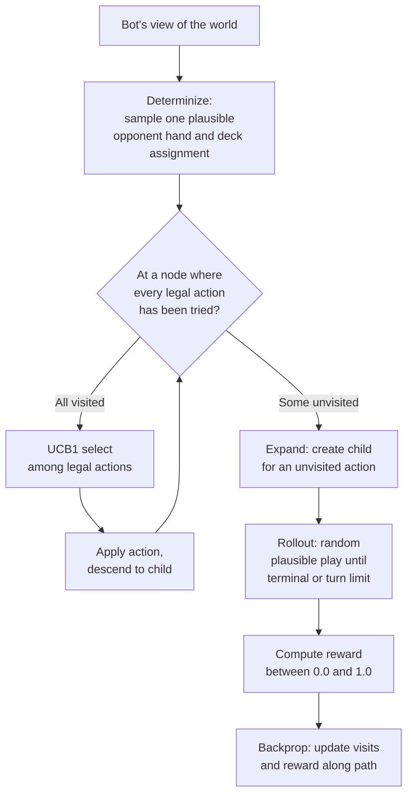
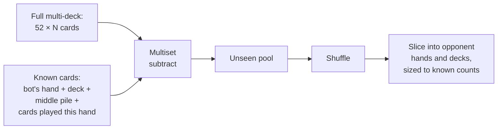

# Building a hidden-information card-game AI with ISMCTS

Standard Monte Carlo Tree Search is a great default for game AI. It plays Go at superhuman strength, has powered chess engines that beat grandmasters in self-play, and is straightforward to implement. The catch is that it assumes you can see the whole game state. The moment you put cards face-down in opponents' hands, MCTS no longer applies directly.

I ran into this building an AI for [Texas Flush'em](https://texas-flush-em.vercel.app/), a card game I designed as a multiplayer take on Balatro's poker-hands-from-a-personal-deck idea. The bot can see its own hand and deck, the middle pile, and every card that's been played so far, but the cards still in opponents' hands and decks are hidden. There's no single state to roll out from. There are millions of states consistent with what the bot can see, and it needs to pick an action that's good in expectation across the whole set.

The fix is Information Set Monte Carlo Tree Search (ISMCTS), specifically the single-tree variant from Cowling, Powley, and Whitehouse (2012). This post is about how I implemented it for [Texas Flush'em](https://texas-flush-em.vercel.app/), the small choices that mattered, and the calibration trick that made easy mode actually feel easy.

The full implementation is at [shared/engine/bot-ismcts.ts](shared/engine/bot-ismcts.ts). It's a companion to the previous post on [building the game with PartyKit](BLOG.md).

## What "information set" actually means

In a perfect-information game, each game state is a node in the search tree. In a hidden-information game, the bot doesn't have a state. It has an *information set*: the set of all states consistent with what it has observed.

Concrete example. The bot is sitting on a hand of cards, with two opponents who each hold some unknown number of cards. There's a middle pile with some cards in it, and a public history of plays from earlier in the round. The bot can see:

- Its own hand and deck contents (deck *order* is unknown, but the multiset is known)
- The cards it has played and seen others play
- The middle pile
- The number of cards each opponent currently holds

Everything else lives in a single shared "unseen pool." Any assignment of those unseen cards to opponent hands and decks is possible. The information set is the set of all such assignments.

ISMCTS handles this by sampling. Each iteration of the search picks one *plausible* arrangement of the hidden cards (a "determinization") and walks the tree as if that were the true state. Over thousands of iterations, the bias from any particular sampling cancels out, and you get a reasonable estimate of which action is best on average across the information set.

## The shape of one iteration

A single ISMCTS iteration looks like this:



Run that 1500 to 20000 times depending on difficulty, then pick the action with the most visits at the root.

The thing that makes this *information set* MCTS rather than vanilla MCTS lives in two places. Each iteration uses a freshly determinized state, and the tree is built over actions rather than states with an extra "availability" counter so actions that were legal less often during determinizations get a fair shake at UCB selection. Both fall out of the Cowling/Powley/Whitehouse paper, and both are small in the implementation.

## Determinization, in code

The determinization function is the heart of the ISMCTS adaptation. Conceptually:



And the actual implementation, lightly trimmed:

```ts
function determinize(state: GameState, botId: string, rng: () => number): GameState {
  const allCards = createMultiDeck(state.deckCount)

  // Collect known cards (everything the bot can see)
  const known: Card[] = []
  const bot = state.players.find(p => p.id === botId)!
  known.push(...bot.hand, ...bot.deck, ...state.middlePile)
  for (const play of state.currentHandPlays) known.push(...play.hand.cards)

  // Multiset subtraction: allCards − known = unseen pool
  const consumed = new Map<string, number>()
  for (const c of known) {
    const k = `${c.rank}|${c.suit}`
    consumed.set(k, (consumed.get(k) ?? 0) + 1)
  }
  const unseen: Card[] = []
  for (const c of allCards) {
    const k = `${c.rank}|${c.suit}`
    const left = consumed.get(k) ?? 0
    if (left > 0) consumed.set(k, left - 1)
    else unseen.push(c)
  }

  shuffleInPlace(unseen, rng)

  // Slice the unseen pool into each opponent's hand and deck
  let cursor = 0
  const newPlayers = state.players.map(p => {
    if (p.id === botId) {
      const deck = [...p.deck]
      shuffleInPlace(deck, rng)
      return { ...p, deck }
    }
    const hand = unseen.slice(cursor, cursor + p.hand.length)
    cursor += p.hand.length
    const deck = unseen.slice(cursor, cursor + p.deck.length)
    cursor += p.deck.length
    return { ...p, hand, deck }
  })

  return { ...state, players: newPlayers }
}
```

Multi-deck mode is the wrinkle. In a single-deck game `allCards` is one of each (rank, suit) and the multiset bookkeeping doesn't matter. With 2-4 decks shuffled together, the same (rank, suit) appears multiple times, so the code tracks how many of each have been "consumed" by known cards before calling something unseen.

The opponent assignment is uniform-random within the unseen pool. Better implementations bias by inferring from past play (if you know your opponent never plays low cards, they probably don't hold many), but I haven't built that. Uniform sampling produces decent play and converges to an OK action choice within the time budget, which is what matters when the bot is a believable opponent in a real session.

## Why I split the action space

A turn in this game has two parts. First, an optional discard: dump up to 5 cards from your hand to the bottom of your deck and redraw. Second, a play (any legal poker hand that beats the current top play) or a fold. Searching both parts together produces a brutal branching factor: every combination of discards times every legal play.

So I cheated. The discard policy is a deterministic heuristic, and ISMCTS only searches the play-or-fold decision. The discard count is decided by what's about to happen:

```ts
// 0 cards if leading, 2 if responding, 5 if about to fold
const count = state.currentTopPlay === null
  ? 0
  : action.type === 'FOLD' ? 5 : 2
```

The intuition is straightforward. Leading the hand means I get to set the bar, so I keep my cards and play whatever is best. Responding means I might not have a winner in hand right now, so a small refresh is worth it. Folding means the hand is over for me and I should churn aggressively to set up the next one.

The card *selection* within that count is also a heuristic. Score every card in hand by how worth keeping it is, then drop the lowest:

```ts
let s = rankValue(c.rank) * 0.1   // baseline: prefer high cards
if (rankGroup >= 5) s += 20       // five of a kind
else if (rankGroup === 4) s += 12 // four of a kind
else if (rankGroup === 3) s += 6  // trips
else if (rankGroup === 2) s += 3  // pair
if (suitGroup >= 5) s += 5        // already a flush
else if (suitGroup === 4) s += 2  // one card off a flush
// + a small straight-adjacency bonus
```

Reserved cards (the ones being played this turn) are excluded from the discard pool. The whole thing runs in O(n²) over a hand of ≤10 cards, which is free.

This split is a real tradeoff. ISMCTS could in principle find smarter discards, like dumping a specific card to set up a four-of-a-kind on the next deal. In practice the heuristic is good enough that searching it isn't worth the branching-factor hit, and players don't seem to notice the difference.

## UCB1 with availability counts

In a perfect-information MCTS, every action at a node is legal in every iteration. In ISMCTS, an action might be legal under some determinizations and illegal under others. Opponent holdings constrain what's reachable, hand sizes change which plays are possible, and so on.

If I just used standard UCB1, I'd over-explore actions that are usually illegal. They'd have low visit counts and look "underexplored," when really they just rarely show up. The Cowling et al. fix is to track an *availability count* per action: how many times has this action been legal during an iteration that visited this node?

```ts
interface EdgeStat {
  visits: number      // times this edge was selected
  reward: number      // total reward accumulated through this edge
  available: number   // times this edge was legal at its parent
}

function ucbSelect(node: Node, actions: BotAction[], c: number): BotAction {
  // ... pick the action that maximizes:
  const exploit = e.reward / e.visits
  const explore = c * Math.sqrt(Math.log(Math.max(1, e.available)) / e.visits)
  return /* arg max of exploit + explore */
}
```

The standard UCB1 formula uses `log(parent.visits)` in the explore term. ISMCTS uses `log(e.available)` instead. Actions that were legal in 80% of iterations get an exploration bonus based on those iterations only, not on the iterations where they couldn't have been picked anyway.

In the search loop, every legal action at every visited node bumps its availability counter:

```ts
const actions = enumerateActions(state, currentId)
for (const a of actions) {
  const key = actionKey(a)
  const e = node.edges.get(key) ?? newEdge()
  if (!node.edges.has(key)) node.edges.set(key, e)
  e.available++
}
```

This is a small change but it's the difference between "ISMCTS" and "MCTS that happens to determinize." Without availability tracking, the search systematically overweights actions that show up in only a fraction of determinizations.

## Rollouts: random play with a fold bias

Once the tree walk reaches an unexpanded node, the iteration switches to a rollout: random plays until terminal state or a turn limit (40 by default at medium difficulty).

Pure uniform-random rollouts are a problem in this game. Folding is always a legal action when responding, and a uniform rollout would have everyone folding 50% of the time, producing mostly random hand outcomes. So rollouts are biased: almost always play, only fold 12% of the time when there's a current top play to beat.

```ts
const foldProb = (s.currentTopPlay !== null && folds.length > 0) ? 0.12 : 0
if (rng() < foldProb) chosen = folds[0]
else chosen = plays[Math.floor(rng() * plays.length)]
```

The 12% number is meant to mimic human caution roughly. ISMCTS purists would push back on this since rollouts are supposed to be uniform, but I found that uniform play wildly underestimated the value of holding strong hands. Uniform rollouts let opponents win hands by folding far more often than humans actually do, which made the bot too willing to bet on weak holdings.

The reward is shaped, not pure win/loss:

```ts
function rewardFor(state, botId): number {
  if (state.roundWinnerId === botId) return 1.0
  if (state.players.find(p => p.id === botId)!.eliminated) return 0
  // Otherwise, partial credit based on how close I am to emptying
  const myRemaining = bot.hand.length + bot.deck.length
  const minOther = Math.min(...others.map(p => p.hand.length + p.deck.length))
  if (myRemaining < minOther) return 0.7   // I'm ahead
  if (myRemaining === minOther) return 0.4 // I'm tied
  return Math.max(0, 0.3 - (myRemaining - minOther) * 0.02)
}
```

Most rollouts hit the turn limit (40 plies) before the round actually ends, so the reward needs to be informative even from a non-terminal state. "Closer to empty than my opponents" is the proxy.

This is the part of the implementation I'd most want to revisit. The reward shape was tuned by playing against the bot and noticing what felt off, not by any principled analysis. There are probably better proxies, and a self-play setup could in principle learn one.

## Difficulty calibration: the easy-mode trick

Three difficulty levels, mapped to ISMCTS knobs:

```ts
const DIFFICULTY_PRESETS = {
  easy:   { iterations: 1500,  timeBudgetMs: 150,  rolloutTurnLimit: 30, randomActionProb: 0.3 },
  medium: { iterations: 8000,  timeBudgetMs: 700,  rolloutTurnLimit: 40, randomActionProb: 0 },
  hard:   { iterations: 20000, timeBudgetMs: 3000, rolloutTurnLimit: 60, randomActionProb: 0 },
}
```

The first three knobs (iterations, time budget, rollout depth) are the obvious ones. The fourth one matters more than I expected.

My initial attempt at "easy mode" was just to give the bot fewer iterations. The result was a bot that thought slowly and then played pretty well anyway, because even 500 iterations of ISMCTS converges to a reasonable choice on the small action spaces this game produces. Turning the budget down further made the bot play instantly with no time to think, and yet still played well, because the heuristics underneath are pretty strong.

The fix is `randomActionProb`. Easy bots run a full search, then 30% of the time discard the result and pick a uniformly-random legal action. Medium and hard never do this:

```ts
if (cfg.randomActionProb > 0 && realActions.length > 1 && rng() < cfg.randomActionProb) {
  chosen = realActions[Math.floor(rng() * realActions.length)]
}
```

The behaviour reads as "missed a beat" rather than "broken AI." The bot still plays solid moves most of the time, then occasionally throws a hand away by playing a single 4 instead of holding for a flush. That feels like a beatable opponent. A bot that searches less but always plays its best move feels like a robot you can't read.

This is a small choice that makes the difficulty selector feel real. I would not have predicted how big the difference is until I shipped both versions and watched players react.

## What I'd do differently

A few things I'd revisit if I came back to this.

The opponent inference is uniform. A medium-effort improvement would be to bias determinizations based on past play. If an opponent has folded twice in a row, they probably don't hold strong hands. If they've played flushes, they probably hold high suits. The ISMCTS literature has variants (PIMC, MO-ISMCTS) that do this principled inference, and I think the gain over uniform sampling would be noticeable at hard difficulty.

The reward shaping is hand-tuned. There are probably learned reward functions, or self-play setups, that would do better. The current shape was tuned by feel.

The rollouts could use a smarter policy than "uniform play with 12% fold." Even a one-step lookahead in rollouts (play the best legal hand by category) would likely improve hard-difficulty strength materially. The reason I haven't done it is that lookahead inside rollouts costs iterations, and the budget is already tight.

The discard heuristic is fixed. Replacing it with a small search (just over discard, holding the play decision constant) would probably help the bot avoid throwing away setup cards. The reason I haven't done it is the same as for rollouts: iteration budget.

But the version that ships is good enough that none of this is urgent. Hard-difficulty bots beat me more than half the time, which is exactly where I want a CPU opponent to land.

## The full code

[shared/engine/bot-ismcts.ts](shared/engine/bot-ismcts.ts) is 449 lines including comments. The companion file [shared/engine/bot-moves.ts](shared/engine/bot-moves.ts) is another 221 lines for action enumeration and discard scoring.

Everything runs on the PartyKit server, on the same Node-ish runtime as the rest of the game. One TypeScript file with tuned constants doing tree search, no separate AI service or model weights involved.

For the multiplayer/architecture side of the project, see the companion post on [building the game with PartyKit](BLOG.md).

---

- **Play:** https://texas-flush-em.vercel.app/
- **Code:** https://github.com/jesse-stewart/texas-flush-em
- **ISMCTS implementation:** [shared/engine/bot-ismcts.ts](shared/engine/bot-ismcts.ts)
- **Reference paper:** Cowling, Powley, Whitehouse, "Information Set Monte Carlo Tree Search" (IEEE TCIAIG, 2012)
